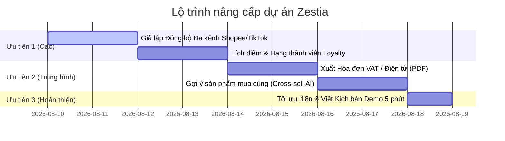

# ĐỀ XUẤT NÂNG CẤP VÀ TỐI ƯU ĐIỂM SỐ ĐỒ ÁN ZESTIA FASHION

> **Ngày lập:** 09/08/2026  
> **Mục tiêu:** Nâng cấp dự án từ mức Khá - Giỏi (8.0 - 8.5 điểm) lên mức **Giỏi - Xuất sắc (9.0 - 10.0 điểm)** trong kỳ bảo vệ Đồ án Tốt nghiệp.

---

## 📌 1. ĐÁNH GIÁ TỔNG QUAN HIỆN TRẠNG DỰ ÁN

Hiện tại, hệ thống **Zestia Fashion** đã sở hữu một nền tảng kỹ thuật rất vững chắc:
- ✅ **Khung công nghệ hiện đại:** Backend Java 21 / Spring Boot 3, Frontend Vue 3 / Vite, SQL Server.
- ✅ **Bao quát đầy đủ nghiệp vụ cốt lõi:** Website bán hàng online, Bán hàng tại quầy (POS), Quản lý ca làm nhân viên, Quản lý kho & Biến động tồn kho (Stock Audit Log).
- ✅ **Đã có nhiều điểm cộng lớn (Nổi bật):** Tích hợp OpenAI ChatAI Copilot, Vòng quay may mắn khép kín với hóa đơn, Thanh toán MoMo/ZaloPay Sandbox, Đa ngôn ngữ (i18n), Báo cáo ca xuất XLSX thật.

**Để ghi điểm tuyệt đối (9.5 - 10.0) trước Hội đồng chấm Đồ án**, hệ thống cần bổ sung một số tính năng có **tính ứng dụng thực tế cao (Real-world enterprise features)** và chứng minh được khả năng **mở rộng hệ thống (Scalability & Integration)**.

---

## 🚀 2. TOP 5 TÍNH NĂNG BỨC PHÁ ĐỂ NÂNG CAO ĐIỂM SỐ (9.0 - 10.0)

### 🔹 1. Giả Lập Đồng Bộ Đa Kênh (Omnichannel Sync - Shopee / TikTok Shop / Lazada)
* **Lý do cần thêm:** Rubric đánh giá đồ án thương mại điện tử luôn đánh giá rất cao tiêu chí "Kênh bán ngoài". Việc có nút đồng bộ thật/giả lập sẽ chứng minh dự án là một hệ thống Omnichannel hoàn chỉnh.
* **Đề xuất triển khai:**
  * Thêm màn hình Admin `/admin/channels` (Quản lý Kênh bán ngoài).
  * Cho phép bấm nút *"Đồng bộ Sản phẩm & Tồn kho lên Shopee/TikTok Shop"* và *"Tải đơn hàng mới từ TikTok Shop về Zestia"*.
  * Hiển thị bảng nhật ký đồng bộ (Sync Logs) với các trạng thái Success/Failed.

### 🔹 2. Chương Trình Khách Hàng Thân Thiết & Tích Điểm (Loyalty Program & Member Tiers)
* **Lý do cần thêm:** Đa số các web bán lẻ thời trang thực tế đều dùng tính năng tích điểm để giữ chân khách hàng (Customer Retention).
* **Đề xuất triển khai:**
  * **Tích điểm:** Tự động cộng 1% giá trị đơn hàng hoàn thành vào ví điểm (`1 điểm = 1.000 VNĐ`).
  * **Hạng thành viên:** Phân hạng tự động (Đồng $\rightarrow$ Bạc $\rightarrow$ Vàng $\rightarrow$ Kim Cương) dựa trên tổng chi tiêu.
  * **Đổi điểm:** Khách hàng có thể dùng điểm thưởng để trừ trực tiếp vào đơn hàng ở bước Checkout hoặc tại quầy POS.

### 🔹 3. AI Tìm Kiếm Bằng Hình Ảnh (Visual Product Search) & Gợi Ý Mua Cùng
* **Lý do cần thêm:** Nâng tầm tính năng AI từ mức Chatbot thông thường lên mức AI hỗ trợ mua sắm thông minh (Visual AI Search).
* **Đề xuất triển khai:**
  * **Tìm bằng ảnh:** Khách hàng tải ảnh mẫu trang phục yêu thích lên $\rightarrow$ Hệ thống tự động phân tích và gợi ý các mẫu váy/áo có màu sắc hoặc kiểu dáng tương tự trong kho Zestia.
  * **Frequently Bought Together:** Tại trang chi tiết sản phẩm (`ProductDetail.vue`), tự động gợi ý *"Thường được mua cùng"* (Ví dụ: Mua Váy Dạ hội $\rightarrow$ Gợi ý thêm Túi xách/Giày cùng tông màu).

### 🔹 4. Quản Lý & Xuất Hóa Đơn Điện Tử / Hóa Đơn VAT (e-Invoice Export)
* **Lý do cần thêm:** Đồ án bán hàng thực tế bắt buộc phải có nghiệp vụ quản lý thuế và hóa đơn doanh nghiệp (VAT).
* **Đề xuất triển khai:**
  * Tại bước Checkout / POS: Khách hàng có thể tick chọn *"Yêu cầu xuất hóa đơn VAT"* $\rightarrow$ Nhập Tên công ty, Mã số thuế (MST), Email nhận hóa đơn.
  * Trong Admin Đơn hàng: Có nút **"Xuất Hóa Đơn Điện Tử (PDF/XML)"** có mã QR lookup hợp chuẩn.

### 🔹 5. Báo Cáo Phân Tích Dữ Liệu Kinh Doanh Nâng Cao (BI Analytics & Stock Reorder Alert)
* **Lý do cần thêm:** Giúp màn hình Dashboard Admin trông cực kỳ chuyên nghiệp và có hàm lượng tri thức cao (Business Intelligence).
* **Đề xuất triển khai:**
  * **Dự báo hàng tồn (Reorder Alert):** Cảnh báo danh sách sản phẩm bán chạy sắp hết hàng và gợi ý số lượng cần nhập tiếp theo dựa trên tốc độ bán 7 ngày qua.
  * **Phân tích khách hàng (RFM Analysis):** Phân nhóm khách hàng (Khách hàng VIP, Khách mới, Khách nguy cơ rời bỏ).

---

## 🛠️ 3. CÁC ĐIỂM CẦN HOÀN THIỆN & TỐI ƯU THÊM (CHẤT LƯỢNG KỸ THUẬT)

| Phân hệ | Yêu cầu tối ưu | Chi tiết cần làm |
| :--- | :--- | :--- |
| **Đa ngôn ngữ (i18n)** | Rà soát từ điển dịch | ✅ **Đã hoàn thành**: Rà soát toàn bộ từ điển và các thông báo lỗi validation từ Backend & Frontend, chuẩn hóa bản dịch Tiếng Anh tự nhiên theo ngôn ngữ thời trang (garment variant, out of stock, size/color guidance, delivery, returns, POS reservation). |
| **Bảo mật & Rate Limit** | Phòng chống spam/brute force | Áp dụng Rate Limiting (Tối đa 5 lần thử/phút) cho các API nhạy cảm như Đăng nhập, Gửi OTP Gmail, Quay thưởng Vòng quay. |
| **Kiểm thử tự động (E2E)** | Bổ sung script test browser | Viết thêm 1 script kiểm thử E2E tự động (dùng Playwright/Selenium hoặc Cypress) chạy giả lập luồng Mua hàng từ A-Z để chiếu video demo khi bảo vệ. |
| **Trải nghiệm Mobile (Responsive)** | Tối ưu hiển thị màn hình nhỏ | Kiểm tra lại giao diện POS và Dashboard Admin trên thiết bị máy tính bảng (Tablet/iPad) vì nhân viên cửa hàng thường dùng iPad bán hàng. |

---

## 📅 4. LỘ TRÌNH THỰC HIỆN ĐỀ XUẤT (PRIORITY ROADMAP)

---

## 💡 5. KỊCH BẢN THUYẾT TRÌNH DEMO BẢO VỆ 5 PHÚT GHI ĐIỂM CAO

1. **Phút 0 - 1:** Giới thiệu tổng quan Zestia - Hệ thống bán thời trang đa kênh kết hợp AI & POS.
2. **Phút 1 - 2:** Demo **Luồng Khách hàng Online**: Duyệt sản phẩm $\rightarrow$ ChatAI tư vấn size $\rightarrow$ Checkout COD/MoMo $\rightarrow$ Nhận thông báo & Quay Vòng quay may mắn.
3. **Phút 2 - 3:** Demo **Luồng Bán hàng POS & Ca làm**: Nhân viên Check-in ca $\rightarrow$ Thao tác POS giữ kho 15p $\rightarrow$ Thanh toán VietQR $\rightarrow$ Mở Báo cáo ca bàn giao két tiền.
4. **Phút 3 - 4:** Demo **Màn hình Admin Quản trị**: Dashboard thống kê $\rightarrow$ Kiểm tra **Nhật ký biến động tồn kho (Stock Audit Log)** $\rightarrow$ Đồng bộ đa kênh Shopee/TikTok.
5. **Phút 4 - 5:** Trình bày về **Kiến trúc An toàn & Kiểm thử**: Test tự động (40 unit/security tests), khóa bi quan chống bán vượt kho, Idempotent payment callback.
